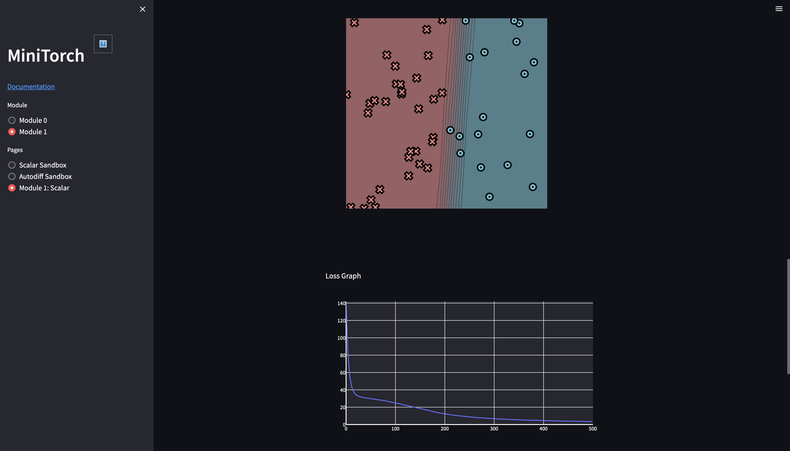
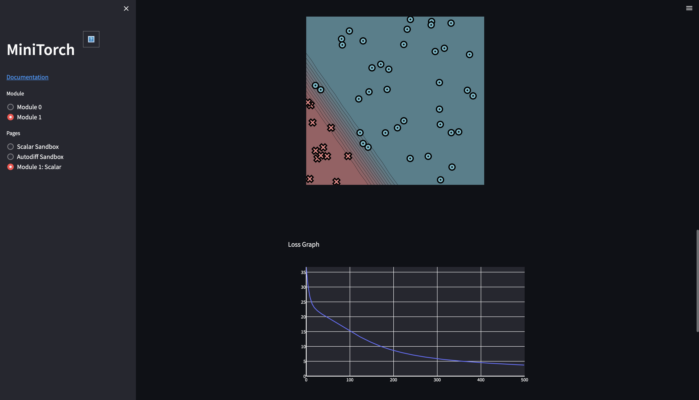
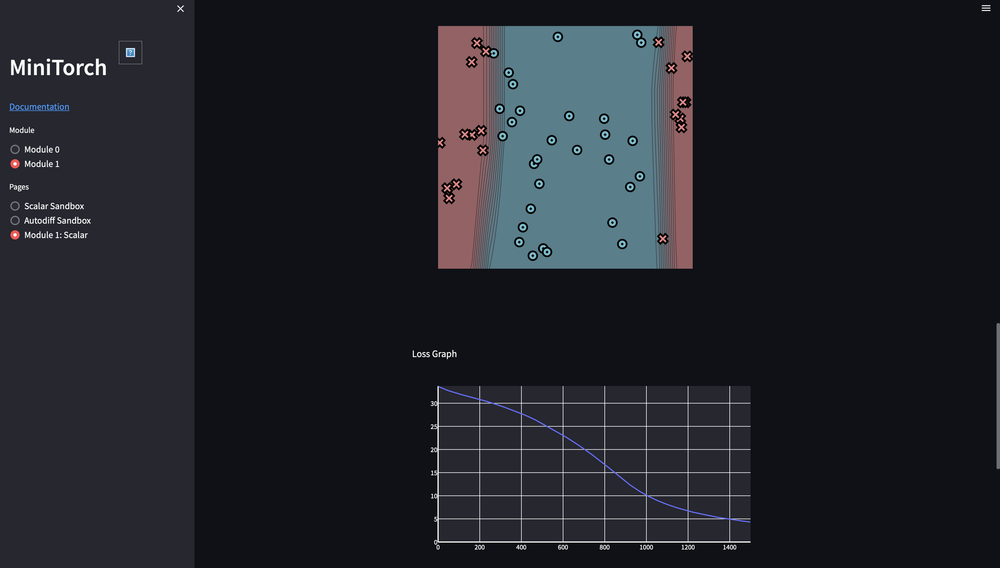
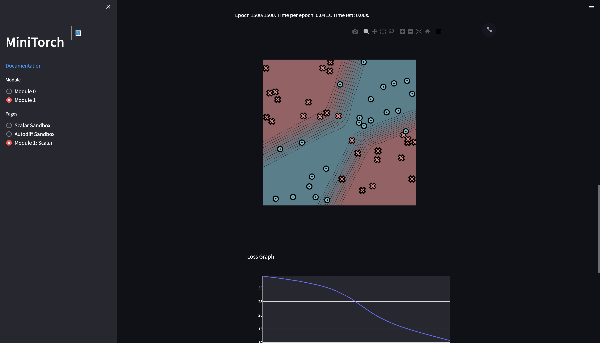
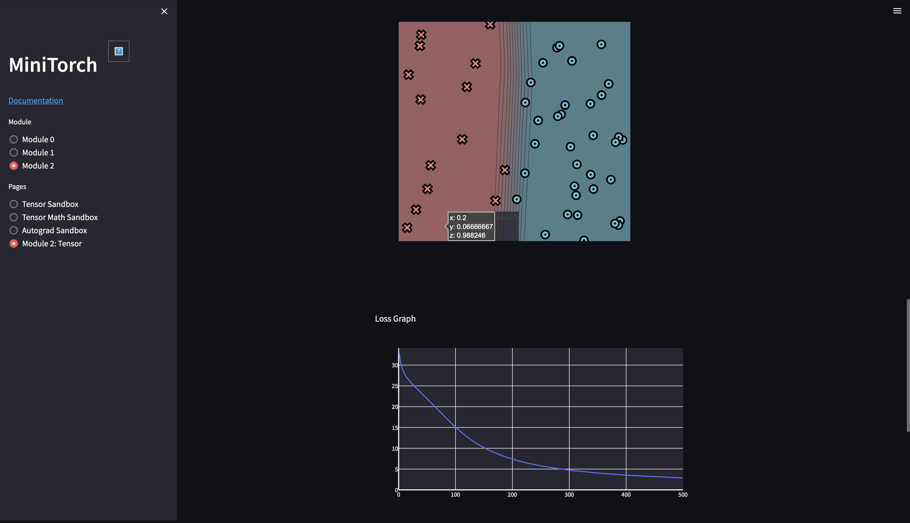
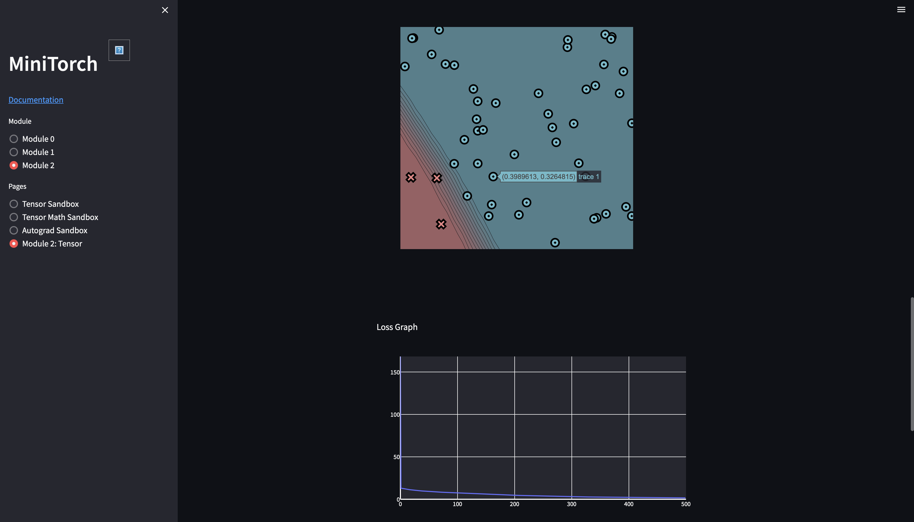
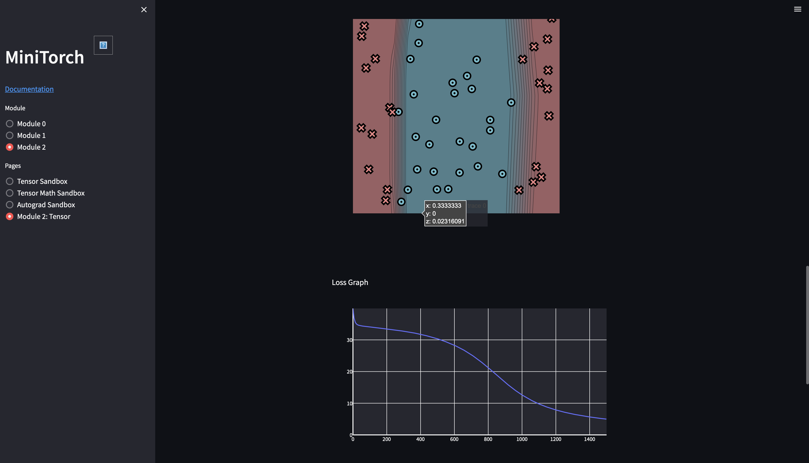
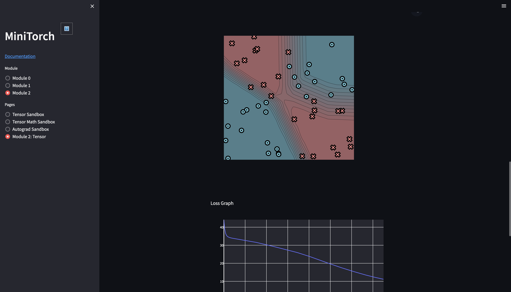
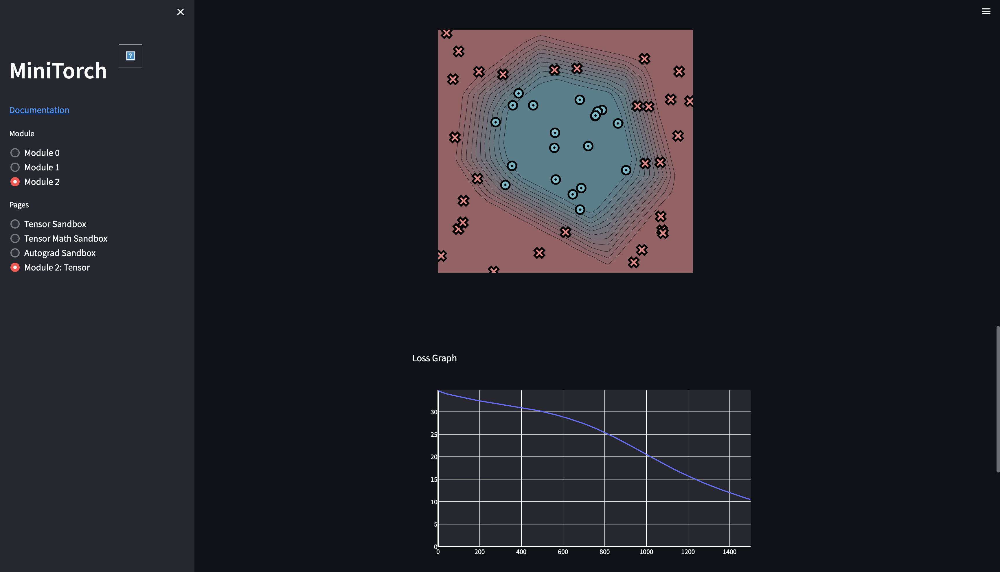
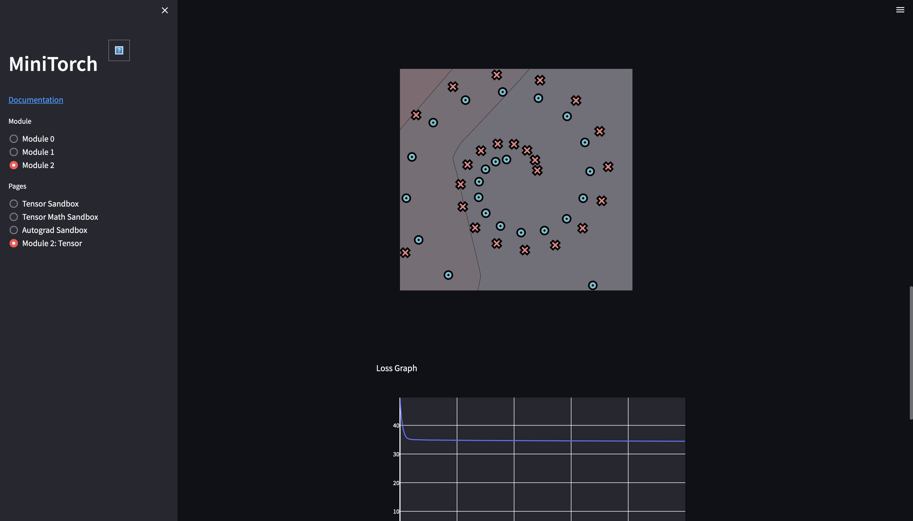

# minitorch

The full minitorch student suite.

## Setup

Requires **Python 3.11** (originally pinned `numba==0.56`/`numpy==1.22` only
support up to Python 3.10, so dependencies were bumped to `numba>=0.57,<0.58`
and `numpy==1.24.4` — the overlapping compatible range, you can compare with previous versions of requirements.txt and
requirements.extra.txt).

```bash
python3.11 -m venv .venv
source .venv/bin/activate
pip install -r requirements.txt
pip install -r requirements.extra.txt
pip check
```

To access the autograder:

* Module 0: https://classroom.github.com/a/qDYKZff9
* Module 1: https://classroom.github.com/a/6TiImUiy
* Module 2: https://classroom.github.com/a/0ZHJeTA0
* Module 3: https://classroom.github.com/a/U5CMJec1
* Module 4: https://classroom.github.com/a/04QA6HZK
* Quizzes: https://classroom.github.com/a/bGcGc12k

## Task 0.5: Visualization

Manually classified the **Simple** dataset using the following parameters:

- weight_0_0 = -10.00
- weight_1_0 = 0.00
- bias_0 = 5.00


## Task 1.5: Training

Trained a small scalar-based neural network (Module 1: Scalar) using the manual autograd/backprop implementation, across
several datasets.

### Simple

Parameters used:

- Hidden layer size: 8
- Learning rate: 0.05
- Epochs: 500
- Dataset: Simple, 50 points

Loss: 2.5\
Final accuracy: ~50/50 correct



### Diag

Parameters used:

- Hidden layer size: 8
- Learning rate: 0.05
- Epochs: 500
- Dataset: Diag, 50 points

Loss: 4.7\
Final accuracy: ~50/50 correct



### Split

Parameters used:

- Hidden layer size: 8
- Learning rate: 0.05
- Epochs: 1500
- Dataset: Split, 50 points

Loss: 4.8\
Final accuracy: ~49/50 correct



### Xor

Parameters used:

- Hidden layer size: 8
- Learning rate: 0.05
- Epochs: 1500
- Dataset: Xor, 50 points

Loss: 10.2\
Final accuracy: ~47/50 correct



## Task 2.5: Tensor Training

Reimplemented the same three-layer network from Module 1 (Linear → ReLU → Linear → ReLU → Linear → Sigmoid), now using
the tensor-based autograd engine (Module 2) instead of scalars. The model architecture and training logic are identical
to `run_scalar.py` — only the underlying representation changed from individual `Scalar` objects to `Tensor`
operations (`map`/`zip`/`reduce`, broadcasting), which build a much smaller computation graph per forward pass and run
the actual arithmetic through vectorized tensor ops instead of per-element Python calls.

Trained and evaluated on all four datasets, using the Streamlit tensor sandbox (Module 2 → Module 2: Tensor).

### Simple

Parameters used:

- Hidden layer size: 8
- Learning rate: 0.05
- Epochs: 500

Loss: ...
Final accuracy: 50/50 correct
Time per epoch: 0.13 s



### Diag

Parameters used:

- Hidden layer size: 8
- Learning rate: 0.05
- Epochs: 500

Loss: 0.4
Final accuracy: 50/50 correct
Time per epoch: 0.13 s



### Split

Parameters used:

- Hidden layer size: 8
- Learning rate: 0.05
- Epochs: 1500

Loss: 6.3
Final accuracy: 50/50 correct
Time per epoch: 0.13 s



### Xor

Parameters used:

- Hidden layer size: 8
- Learning rate: 0.05
- Epochs: 1500

Loss: 10.1
Final accuracy: 48/50 correct
Time per epoch: 0.13 s



### Circle

Parameters used:

- Hidden layer size: 8
- Learning rate: 0.05
- Epochs: 1500

Loss: 10.2
Final accuracy: 50/50 correct
Time per epoch: 0.13 s



### Spiral

Parameters used:

- Hidden layer size: 8
- Learning rate: 0.05
- Epochs: 1500

Loss: 34.2
Final accuracy: 27/50 correct
Time per epoch: 0.13 s



## Task 3.1 & 3.2: Parallelization

Implemented parallel `map`, `zip`, `reduce`, and `matrix_multiply` in `fast_ops.py` using Numba's `@njit(parallel=True)`
and `prange`.

### Note on `inline="always"`

The template pins `to_index`, `index_to_position`, and `broadcast_index` with
`njit(inline="always")`. On the Numba version used here (0.67.x), this triggers
a known Numba bug ([numba/numba#7652](https://github.com/numba/numba/issues/7652))
where the parfor pass misidentifies an inlined function's internal loop variable
as an "overwrite of the parallel loop index," causing an `UnsupportedRewriteError`.
Removing the forced inlining (using plain `njit()` instead) resolves this without
any change to correctness or the required optimizations — `inline="always"` is
purely a compilation strategy hint, not part of the algorithm's semantics.

### Optimizations implemented

- **`tensor_map`** / **`tensor_zip`**: main loop parallelized via `prange`; index
  buffers allocated once per thread (hoisted by Numba, confirmed in diagnostics
  below); fast path added for stride-aligned tensors that skips indexing entirely.
- **`tensor_reduce`**: main loop parallelized via `prange`; inner reduction loop
  advances storage position by adding `reduce_stride` directly, with no function
  calls or indexing inside the inner loop.
- **`_tensor_matrix_multiply`**: outer (batch) loop parallelized via `prange`;
  no index buffers or function calls anywhere — positions computed directly from
  strides; inner loop over the shared dimension performs exactly one multiply per
  iteration and accumulates into a local variable, writing to `out` only once
  after the loop completes.

### Diagnostics output (`python project/parallel_check.py`)

```
MAP
 
================================================================================
 Parallel Accelerator Optimizing:  Function tensor_map.<locals>._map, /Users/mac
book/PycharmProjects/TensorAndDL_LibrariesPractice/minitorch/minitorch/fast_ops.
py (154)  
================================================================================


Parallel loop listing for  Function tensor_map.<locals>._map, /Users/macbook/PycharmProjects/TensorAndDL_LibrariesPractice/minitorch/minitorch/fast_ops.py (154) 
-----------------------------------------------------------------------------|loop #ID
    def _map(                                                                | 
            out: Storage,                                                    | 
            out_shape: Shape,                                                | 
            out_strides: Strides,                                            | 
            in_storage: Storage,                                             | 
            in_shape: Shape,                                                 | 
            in_strides: Strides,                                             | 
    ) -> None:                                                               | 
        if (                                                                 | 
                len(out_strides) == len(in_strides)                          | 
                and (out_strides == in_strides).all()------------------------| #0
                and (out_shape == in_shape).all()----------------------------| #1
        ):                                                                   | 
            for i in prange(len(out)):---------------------------------------| #3
                out[i] = fn(in_storage[i])                                   | 
        else:                                                                | 
            for i in prange(len(out)):---------------------------------------| #2
                out_index = np.empty(MAX_DIMS, np.int32)                     | 
                in_index = np.empty(MAX_DIMS, np.int32)                      | 
                to_index(i, out_shape, out_index)                            | 
                broadcast_index(out_index, out_shape, in_shape, in_index)    | 
                out_pos = index_to_position(out_index, out_strides)          | 
                in_pos = index_to_position(in_index, in_strides)             | 
                out[out_pos] = fn(in_storage[in_pos])                        | 
--------------------------------- Fusing loops ---------------------------------
Attempting fusion of parallel loops (combines loops with similar properties)...
Following the attempted fusion of parallel for-loops there are 4 parallel for-
loop(s) (originating from loops labelled: #0, #1, #3, #2).
--------------------------------------------------------------------------------
----------------------------- Before Optimisation ------------------------------
--------------------------------------------------------------------------------
------------------------------ After Optimisation ------------------------------
Parallel structure is already optimal.
--------------------------------------------------------------------------------
--------------------------------------------------------------------------------
 
---------------------------Loop invariant code motion---------------------------
Allocation hoisting:
The memory allocation derived from the instruction at /Users/macbook/PycharmProj
ects/TensorAndDL_LibrariesPractice/minitorch/minitorch/fast_ops.py (171) is 
hoisted out of the parallel loop labelled #2 (it will be performed before the 
loop is executed and reused inside the loop):
   Allocation:: out_index = np.empty(MAX_DIMS, np.int32)
    - numpy.empty() is used for the allocation.
The memory allocation derived from the instruction at /Users/macbook/PycharmProj
ects/TensorAndDL_LibrariesPractice/minitorch/minitorch/fast_ops.py (172) is 
hoisted out of the parallel loop labelled #2 (it will be performed before the 
loop is executed and reused inside the loop):
   Allocation:: in_index = np.empty(MAX_DIMS, np.int32)
    - numpy.empty() is used for the allocation.
None
ZIP
 
================================================================================
 Parallel Accelerator Optimizing:  Function tensor_zip.<locals>._zip, /Users/mac
book/PycharmProjects/TensorAndDL_LibrariesPractice/minitorch/minitorch/fast_ops.
py (204)  
================================================================================


Parallel loop listing for  Function tensor_zip.<locals>._zip, /Users/macbook/PycharmProjects/TensorAndDL_LibrariesPractice/minitorch/minitorch/fast_ops.py (204) 
---------------------------------------------------------------------------|loop #ID
    def _zip(                                                              | 
            out: Storage,                                                  | 
            out_shape: Shape,                                              | 
            out_strides: Strides,                                          | 
            a_storage: Storage,                                            | 
            a_shape: Shape,                                                | 
            a_strides: Strides,                                            | 
            b_storage: Storage,                                            | 
            b_shape: Shape,                                                | 
            b_strides: Strides,                                            | 
    ) -> None:                                                             | 
        if (                                                               | 
                len(out_strides) == len(a_strides)                         | 
                and len(out_strides) == len(b_strides)                     | 
                and (out_strides == a_strides).all()-----------------------| #4
                and (out_strides == b_strides).all()-----------------------| #5
                and (out_shape == a_shape).all()---------------------------| #6
                and (out_shape == b_shape).all()---------------------------| #7
        ):                                                                 | 
            for i in prange(len(out)):-------------------------------------| #8
                out[i] = fn(a_storage[i], b_storage[i])                    | 
        else:                                                              | 
            for i in prange(len(out)):-------------------------------------| #9
                out_index = np.empty(MAX_DIMS, np.int32)                   | 
                a_index = np.empty(MAX_DIMS, np.int32)                     | 
                b_index = np.empty(MAX_DIMS, np.int32)                     | 
                to_index(i, out_shape, out_index)                          | 
                broadcast_index(out_index, out_shape, a_shape, a_index)    | 
                broadcast_index(out_index, out_shape, b_shape, b_index)    | 
                out_pos = index_to_position(out_index, out_strides)        | 
                a_pos = index_to_position(a_index, a_strides)              | 
                b_pos = index_to_position(b_index, b_strides)              | 
                out[out_pos] = fn(a_storage[a_pos], b_storage[b_pos])      | 
--------------------------------- Fusing loops ---------------------------------
Attempting fusion of parallel loops (combines loops with similar properties)...
Following the attempted fusion of parallel for-loops there are 6 parallel for-
loop(s) (originating from loops labelled: #4, #5, #6, #7, #8, #9).
--------------------------------------------------------------------------------
----------------------------- Before Optimisation ------------------------------
--------------------------------------------------------------------------------
------------------------------ After Optimisation ------------------------------
Parallel structure is already optimal.
--------------------------------------------------------------------------------
--------------------------------------------------------------------------------
 
---------------------------Loop invariant code motion---------------------------
Allocation hoisting:
The memory allocation derived from the instruction at /Users/macbook/PycharmProj
ects/TensorAndDL_LibrariesPractice/minitorch/minitorch/fast_ops.py (227) is 
hoisted out of the parallel loop labelled #9 (it will be performed before the 
loop is executed and reused inside the loop):
   Allocation:: out_index = np.empty(MAX_DIMS, np.int32)
    - numpy.empty() is used for the allocation.
The memory allocation derived from the instruction at /Users/macbook/PycharmProj
ects/TensorAndDL_LibrariesPractice/minitorch/minitorch/fast_ops.py (228) is 
hoisted out of the parallel loop labelled #9 (it will be performed before the 
loop is executed and reused inside the loop):
   Allocation:: a_index = np.empty(MAX_DIMS, np.int32)
    - numpy.empty() is used for the allocation.
The memory allocation derived from the instruction at /Users/macbook/PycharmProj
ects/TensorAndDL_LibrariesPractice/minitorch/minitorch/fast_ops.py (229) is 
hoisted out of the parallel loop labelled #9 (it will be performed before the 
loop is executed and reused inside the loop):
   Allocation:: b_index = np.empty(MAX_DIMS, np.int32)
    - numpy.empty() is used for the allocation.
None
REDUCE
 
================================================================================
 Parallel Accelerator Optimizing:  Function tensor_reduce.<locals>._reduce, /Use
rs/macbook/PycharmProjects/TensorAndDL_LibrariesPractice/minitorch/minitorch/fas
t_ops.py (260)  
================================================================================


Parallel loop listing for  Function tensor_reduce.<locals>._reduce, /Users/macbook/PycharmProjects/TensorAndDL_LibrariesPractice/minitorch/minitorch/fast_ops.py (260) 
-------------------------------------------------------------------|loop #ID
    def _reduce(                                                   | 
            out: Storage,                                          | 
            out_shape: Shape,                                      | 
            out_strides: Strides,                                  | 
            a_storage: Storage,                                    | 
            a_shape: Shape,                                        | 
            a_strides: Strides,                                    | 
            reduce_dim: int,                                       | 
    ) -> None:                                                     | 
        reduce_stride = a_strides[reduce_dim]                      | 
        reduce_size = a_shape[reduce_dim]                          | 
                                                                   | 
        for i in prange(len(out)):---------------------------------| #10
            out_index = np.empty(MAX_DIMS, np.int32)               | 
            to_index(i, out_shape, out_index)                      | 
            out_pos = index_to_position(out_index, out_strides)    | 
                                                                   | 
            j = index_to_position(out_index, a_strides)            | 
                                                                   | 
            acc = out[out_pos]                                     | 
            for k in range(reduce_size):                           | 
                acc = fn(acc, a_storage[j])                        | 
                j += reduce_stride                                 | 
            out[out_pos] = acc                                     | 
--------------------------------- Fusing loops ---------------------------------
Attempting fusion of parallel loops (combines loops with similar properties)...
Following the attempted fusion of parallel for-loops there are 1 parallel for-
loop(s) (originating from loops labelled: #10).
--------------------------------------------------------------------------------
----------------------------- Before Optimisation ------------------------------
--------------------------------------------------------------------------------
------------------------------ After Optimisation ------------------------------
Parallel structure is already optimal.
--------------------------------------------------------------------------------
--------------------------------------------------------------------------------
 
---------------------------Loop invariant code motion---------------------------
Allocation hoisting:
The memory allocation derived from the instruction at /Users/macbook/PycharmProj
ects/TensorAndDL_LibrariesPractice/minitorch/minitorch/fast_ops.py (273) is 
hoisted out of the parallel loop labelled #10 (it will be performed before the 
loop is executed and reused inside the loop):
   Allocation:: out_index = np.empty(MAX_DIMS, np.int32)
    - numpy.empty() is used for the allocation.
None
MATRIX MULTIPLY
 
================================================================================
 Parallel Accelerator Optimizing:  Function _tensor_matrix_multiply, /Users/macb
ook/PycharmProjects/TensorAndDL_LibrariesPractice/minitorch/minitorch/fast_ops.p
y (288)  
================================================================================


Parallel loop listing for  Function _tensor_matrix_multiply, /Users/macbook/PycharmProjects/TensorAndDL_LibrariesPractice/minitorch/minitorch/fast_ops.py (288) 
--------------------------------------------------------------------|loop #ID
def _tensor_matrix_multiply(                                        | 
        out: Storage,                                               | 
        out_shape: Shape,                                           | 
        out_strides: Strides,                                       | 
        a_storage: Storage,                                         | 
        a_shape: Shape,                                             | 
        a_strides: Strides,                                         | 
        b_storage: Storage,                                         | 
        b_shape: Shape,                                             | 
        b_strides: Strides,                                         | 
) -> None:                                                          | 
    """                                                             | 
    NUMBA tensor matrix multiply function.                          | 
                                                                    | 
    Should work for any tensor shapes that broadcast as long as     | 
                                                                    | 
    ```                                                             | 
    assert a_shape[-1] == b_shape[-2]                               | 
    ```                                                             | 
                                                                    | 
    Optimizations:                                                  | 
                                                                    | 
    * Outer loop in parallel                                        | 
    * No index buffers or function calls                            | 
    * Inner loop should have no global writes, 1 multiply.          | 
                                                                    | 
                                                                    | 
    Args:                                                           | 
        out (Storage): storage for `out` tensor                     | 
        out_shape (Shape): shape for `out` tensor                   | 
        out_strides (Strides): strides for `out` tensor             | 
        a_storage (Storage): storage for `a` tensor                 | 
        a_shape (Shape): shape for `a` tensor                       | 
        a_strides (Strides): strides for `a` tensor                 | 
        b_storage (Storage): storage for `b` tensor                 | 
        b_shape (Shape): shape for `b` tensor                       | 
        b_strides (Strides): strides for `b` tensor                 | 
                                                                    | 
    Returns:                                                        | 
        None : Fills in `out`                                       | 
    """                                                             | 
    a_batch_stride = a_strides[0] if a_shape[0] > 1 else 0          | 
    b_batch_stride = b_strides[0] if b_shape[0] > 1 else 0          | 
                                                                    | 
    a_row_stride = a_strides[-2]                                    | 
    a_col_stride = a_strides[-1]                                    | 
    b_row_stride = b_strides[-2]                                    | 
    b_col_stride = b_strides[-1]                                    | 
                                                                    | 
    out_batch_stride = out_strides[0] if out_shape[0] > 1 else 0    | 
    out_row_stride = out_strides[-2]                                | 
    out_col_stride = out_strides[-1]                                | 
                                                                    | 
    batch_size = out_shape[0]                                       | 
    row_size = out_shape[-2]                                        | 
    col_size = out_shape[-1]                                        | 
    inner_size = a_shape[-1]                                        | 
                                                                    | 
    for batch in prange(batch_size):--------------------------------| #11
        a_batch_off = batch * a_batch_stride                        | 
        b_batch_off = batch * b_batch_stride                        | 
        out_batch_off = batch * out_batch_stride                    | 
                                                                    | 
        for i in range(row_size):                                   | 
            a_offset = a_batch_off + i * a_row_stride               | 
            out_offset = out_batch_off + i * out_row_stride         | 
                                                                    | 
            for j in range(col_size):                               | 
                a_pos = a_offset                                    | 
                b_pos = b_batch_off + j * b_col_stride              | 
                                                                    | 
                acc = 0.0                                           | 
                for k in range(inner_size):                         | 
                    acc += a_storage[a_pos] * b_storage[b_pos]      | 
                    a_pos += a_col_stride                           | 
                    b_pos += b_row_stride                           | 
                out[out_offset + j * out_col_stride] = acc          | 
--------------------------------- Fusing loops ---------------------------------
Attempting fusion of parallel loops (combines loops with similar properties)...
Following the attempted fusion of parallel for-loops there are 1 parallel for-
loop(s) (originating from loops labelled: #11).
--------------------------------------------------------------------------------
----------------------------- Before Optimisation ------------------------------
--------------------------------------------------------------------------------
------------------------------ After Optimisation ------------------------------
Parallel structure is already optimal.
--------------------------------------------------------------------------------
--------------------------------------------------------------------------------
 
---------------------------Loop invariant code motion---------------------------
Allocation hoisting:
No allocation hoisting found
None
```

### On Fast GPU/CPU:

### Simple

- GPU: Time/epoch: 1.36 s | Final loss: 0.02 | Accuracy: 50/50
- CPU: Time/epoch: 0.21 s | Final loss: 0.60 | Accuracy: 50/50

### Split

- GPU: Time/epoch: 1.44 s | Final loss: 0.13 | Accuracy: 50/50
- CPU: Time/epoch: 0.18 s | Final loss: 0.43 | Accuracy: 50/50

### Xor

- GPU: Time/epoch: 1.39 s | Final loss: 0.71 | Accuracy: 50/50
- CPU: Time/epoch: 0.24 s | Final loss: 1.03 | Accuracy: 50/50

### Honest Analysis: GPU vs CPU Performance

Across all three datasets, the CPU backend (`FastOps`, Numba `prange` parallelism from Task 3.1) consistently
**outperformed** the GPU backend (`CudaOps`, Task 3.3/3.4) by roughly **6-8x** at this problem scale (`HIDDEN=100`,
`PTS=50`, `BATCH=10`):

| Dataset | GPU time/epoch | CPU time/epoch | CPU is faster by |
|---------|----------------|----------------|------------------|
| Simple  | 1.36 s         | 0.21 s         | ~6.5x            |
| Split   | 1.44 s         | 0.18 s         | ~8.0x            |
| Xor     | 1.39 s         | 0.24 s         | ~5.8x            |

**This is the opposite of what raw hardware throughput would predict** — this GPU has far more FLOPS and memory
bandwidth than the CPU. The cause is not the CUDA kernels themselves (`tensor_map`, `tensor_zip`, `tensor_reduce`,
`_tensor_matrix_multiply` all pass 100% of `task3_3`/`task3_4` correctness tests), but a **device-residency problem**
one layer above them, in the base `Tensor`/`TensorData` utilities:

- `NumbaPerformanceWarning: Host array used in CUDA kernel will incur copy overhead to/from device` fired on essentially
  every single kernel launch throughout training.
- `Tensor.zeros()` builds its buffer as a plain Python list → `numpy.ndarray`, then calls `to_cuda_()` to copy it to
  device — this happens **for every intermediate tensor in the computation graph** (every `Add`, `Mul`, `ReLU`,
  `Sigmoid`, `MatMul` output), not just once for the model's weights.
- `Tensor._ensure_tensor()` does the same host-then-copy pattern every time a raw Python scalar (e.g. `1.0` in
  `(out - 1.0) * (y - 1.0)`) is combined with a tensor.
- With ~30-50 elementwise/matmul operations per forward+backward pass and 5 batches per epoch, this adds up to hundreds
  of PCIe round-trips per epoch, each carrying a fixed latency cost that dwarfs the actual compute time for tensors this
  small.

**Attempted fix:** replaced `Tensor.zeros()`'s host-list-then-copy with a direct `cuda.device_array()` allocation,
hoping to skip the transfer entirely for freshly-created output buffers.

**Result: performance got *worse***, not better. The likely explanation is that `cuda.device_array()` triggers a fresh
`cudaMalloc` for every one of these hundreds of per-epoch tensors, and GPU memory allocation carries its own non-trivial
fixed overhead (device synchronization, allocator bookkeeping) — for this workload's many small, short-lived
allocations, that overhead apparently exceeded the cost of the original host-copy path. This change was reverted; the
results above reflect the original `zeros()` implementation.

**Conclusion:** GPU throughput advantages only materialize once per-kernel compute time exceeds fixed per-launch
overhead (transfer and/or allocation). At `HIDDEN=100` with a 50-point dataset, the tensors involved are simply too
small for that to happen — the CUDA kernels are correct and would scale well on larger workloads, but the surrounding
memory-management layer (not part of this assignment's Task 3.1-3.4 scope) does not keep intermediate tensors
GPU-resident across operations. Production frameworks (PyTorch, TensorFlow) solve exactly this problem with a
caching/pooling allocator that reuses device memory instead of calling `cudaMalloc`/copy on every op — implementing one
is the realistic "cleverness" the assignment alludes to, but is beyond the scope of the kernel-level tasks here.