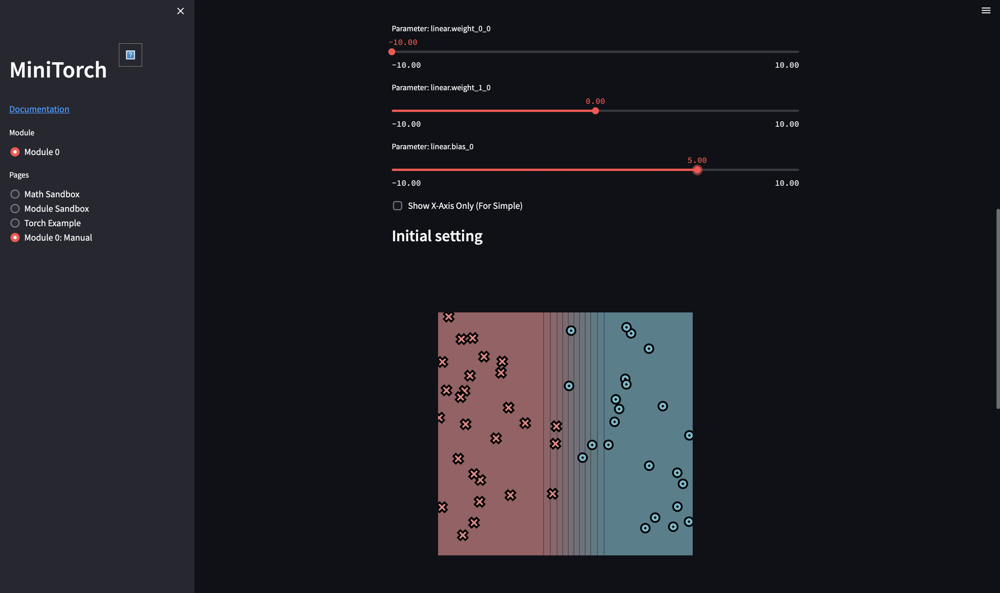

# minitorch
The full minitorch student suite. 

## Setup

Requires **Python 3.11** (originally pinned `numba==0.56`/`numpy==1.22` only 
support up to Python 3.10, so dependencies were bumped to `numba>=0.57,<0.58` 
and `numpy==1.24.4` — the overlapping compatible range, you can compare with previous versions of requirements.txt and requirements.extra.txt).

```bash
python3.11 -m venv .venv
source .venv/bin/activate
pip install -r requirements.txt
pip install -r requirements.extra.txt
pip check
```

To access the autograder: 

* Module 0: https://classroom.github.com/a/qDYKZff9
* Module 1: https://classroom.github.com/a/6TiImUiy
* Module 2: https://classroom.github.com/a/0ZHJeTA0
* Module 3: https://classroom.github.com/a/U5CMJec1
* Module 4: https://classroom.github.com/a/04QA6HZK
* Quizzes: https://classroom.github.com/a/bGcGc12k


## Task 0.5: Visualization

Manually classified the **Simple** dataset using the following parameters:
- weight_0_0 = -10.00
- weight_1_0 = 0.00
- bias_0 = 5.00

